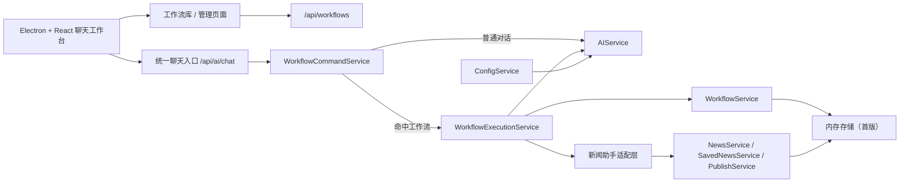

# AI 助手 - 技术架构文档

## 1. 架构目标
系统从“单一新闻创作工具”升级为“聊天驱动的工作流平台”。整体架构需要满足三件事：
- 聊天是统一入口。
- 工作流定义可注册、可管理、可执行。
- 既有新闻能力通过内置工作流适配，而不是被直接废弃。

## 2. 总体架构


## 3. 前端架构
### 3.1 页面层
- `Chat`：主工作台，承载普通对话、工作流命令、工作流执行结果与最近执行记录。
- `Workflows`：工作流管理页，支持查看内置工作流、创建/编辑/删除自定义工作流。
- `NewsList` / `NewsEdit`：保留为任务结果相关页面，承载新闻类结果的后续管理。
- `Settings` / `Config`：保留为能力依赖配置页。

### 3.2 状态层
Zustand store 以以下状态为核心：
- `conversationMessages`
- `workflows`
- `workflowExecutions`
- `selectedWorkflow`
- `newsArticles`
- `savedNews`
- `selectedNews`

`ConversationMessage` 扩展支持：
- `workflowId`
- `workflowInvocation`
- `messageType`
- `executionId`
- `artifacts`

### 3.3 交互机制
- 输入框监听 `/` 与 `/+`，展示工作流候选。
- 选中工作流后，允许“预选工作流 + 自然语言输入”的发送方式。
- 若消息本身是 slash command，前端优先调用命令解析，未命中时给出错误提示。

## 4. 后端架构
### 4.1 职责划分
- `AIService`
  - 负责底层模型调用。
  - 根据用户配置选择 OpenAI、Ollama、llama.cpp 等提供方。
- `WorkflowService`
  - 负责工作流定义的 CRUD。
  - 负责注册内置工作流。
  - 首版采用内存存储。
- `WorkflowCommandService`
  - 负责解析 `/<名称>` 与 `/+<名称>`。
  - 根据工作流注册表匹配命令。
- `WorkflowExecutionService`
  - 负责加载工作流定义。
  - 组装系统提示与执行上下文。
  - 严格按工作流步骤与约束驱动 AI 执行。
  - 记录执行历史。
- `AIController`
  - 保留 `/api/ai/chat` 作为统一聊天入口。
  - 先走命令解析；命中工作流则转入工作流执行服务。

### 4.2 内置工作流适配
首版提供一个内置工作流：
- `新闻助手`

该工作流通过 `WorkflowExecutionService` 注入新闻上下文，并复用：
- `NewsService`
- `SavedNewsService`
- `PublishService`

这样现有新闻能力在产品层退为“工作流能力”，在技术层仍可复用现有服务。

## 5. API 设计
### 5.1 聊天接口
`POST /api/ai/chat`

请求体：
```json
{
  "userId": "1",
  "message": "/新闻助手 帮我写一篇简讯",
  "referencedNewsId": "news-1",
  "history": [
    { "role": "user", "content": "..." },
    { "role": "assistant", "content": "..." }
  ]
}
```

返回体支持：
- `content`
- `workflow`
- `execution`
- `artifacts`

### 5.2 工作流接口
- `GET /api/workflows`
- `POST /api/workflows`
- `GET /api/workflows/:id`
- `PUT /api/workflows/:id`
- `DELETE /api/workflows/:id`
- `GET /api/workflows/executions?userId=1`
- `POST /api/workflows/parse-command`
- `POST /api/workflows/:id/execute`

## 6. 数据模型
### 6.1 WorkflowDefinition
- `id`
- `name`
- `displayName`
- `description`
- `invocation`
- `systemInstruction`
- `steps`
- `inputSchema`
- `outputSchema`
- `constraints`
- `tools`
- `capabilities`
- `examples`
- `extensionNotes`
- `isBuiltIn`
- `status`
- `createdAt`
- `updatedAt`

### 6.2 WorkflowExecution
- `id`
- `workflowId`
- `workflowName`
- `invocation`
- `userId`
- `input`
- `output`
- `status`
- `artifacts`
- `createdAt`
- `completedAt`
- `error`

## 7. 执行流程
### 7.1 普通对话
1. 前端调用 `/api/ai/chat`
2. 后端解析消息，不命中工作流
3. `AIService` 以通用助手系统提示生成回复
4. 返回内容到聊天页

### 7.2 工作流对话
1. 前端发送 slash command 或预选工作流上下文
2. 后端命中 `WorkflowCommandService`
3. `WorkflowExecutionService` 读取工作流定义
4. 组装严格执行系统提示、步骤与约束
5. 如为新闻助手，则追加新闻上下文
6. `AIService` 调用模型生成内容
7. 记录 `WorkflowExecution`
8. 返回结果、工作流信息与执行信息

## 8. 存储策略
- 首版继续使用当前内存态服务，优先完成工作流平台闭环。
- 工作流定义和执行记录先保存在服务静态内存中。
- 下一阶段如需持久化，可迁移到数据库或本地文件，不改变 API 形态。

## 9. 测试策略
- 类型检查：`npm run typecheck:frontend`、`npm run typecheck:api`
- 回归测试：`npm test -- --runInBand`
- 核心场景：
  - 普通聊天
  - slash command 调用工作流
  - 内置工作流新闻助手执行
  - 自定义工作流创建/编辑/删除
  - 配置页与保存结果页不回归
