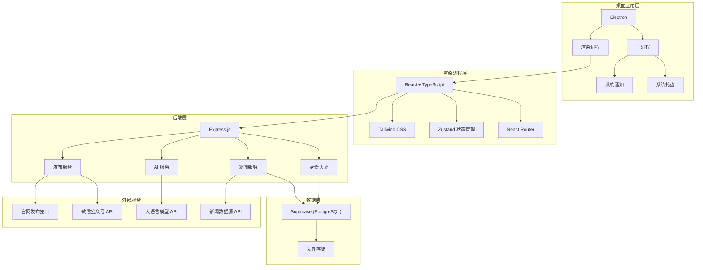
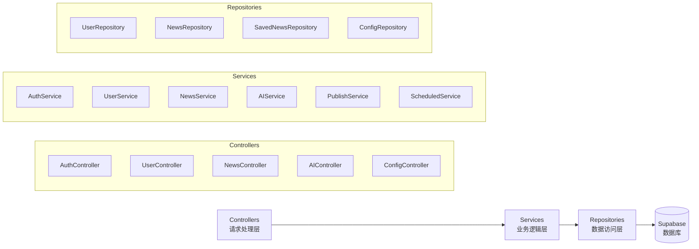
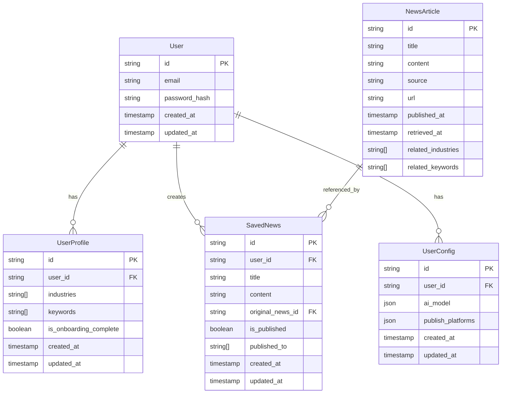

# AI 新闻创作工具 - 技术架构文档

## 1. Architecture Design



## 2. Technology Description

- **Desktop Framework**: Electron + electron-builder
- **Frontend**: React@18 + TypeScript + Tailwind CSS@3 + Vite
- **Initialization Tool**: vite-init
- **Backend**: Express.js@4 + TypeScript
- **Database**: Supabase (PostgreSQL)
- **State Management**: Zustand
- **Routing**: React Router DOM
- **Icons**: Lucide React
- **Scheduled Tasks**: node-cron
- **Packaging**: electron-builder

## 3. Route Definitions

| Route | Purpose |
|-------|---------|
| /login | 登录页面 |
| /register | 注册页面 |
| /chat | 对话交互页面（首页） |
| /settings | 用户设置页面 |
| /news | 新闻管理页面 |
| /news/edit/:id | 新闻编辑页面 |
| /config | 系统配置页面 |

## 4. API Definitions

### 4.1 User APIs

```typescript
// 用户信息
interface UserProfile {
  id: string;
  email: string;
  industries: string[];
  keywords: string[];
  isOnboardingComplete: boolean;
  createdAt: string;
  updatedAt: string;
}

// 获取/更新用户信息
GET /api/user/profile
PUT /api/user/profile
```

### 4.2 News APIs

```typescript
// 新闻数据结构
interface NewsArticle {
  id: string;
  title: string;
  content: string;
  source: string;
  url: string;
  publishedAt: string;
  createdAt: string;
}

interface SavedNews {
  id: string;
  userId: string;
  title: string;
  content: string;
  originalNewsId?: string;
  isPublished: boolean;
  publishedTo: string[];
  createdAt: string;
  updatedAt: string;
}

// 获取推送的新闻
GET /api/news/recent?userId={userId}

// 获取保存的新闻
GET /api/news/saved?userId={userId}

// 保存新闻
POST /api/news/saved
{
  userId: string;
  title: string;
  content: string;
  originalNewsId?: string;
}

// 更新新闻
PUT /api/news/saved/:id

// 发布新闻
POST /api/news/publish/:id
{
  platforms: string[]; // ['website', 'wechat']
}

// 手动触发新闻更新
POST /api/news/update
```

### 4.3 AI APIs

```typescript
// AI 对话请求
POST /api/ai/chat
{
  userId: string;
  message: string;
  referencedNewsId?: string;
  history: Array<{
    role: 'user' | 'assistant';
    content: string;
  }>;
}

// AI 新闻创作请求
POST /api/ai/compose
{
  userId: string;
  prompt: string;
  referencedNewsIds?: string[];
}
```

### 4.4 Config APIs

```typescript
// 配置数据结构
interface Config {
  aiModel: {
    provider: string;
    apiKey: string;
    modelName: string;
    baseUrl?: string;
  };
  publishPlatforms: {
    website?: {
      apiUrl: string;
      apiKey: string;
    };
    wechat?: {
      appId: string;
      appSecret: string;
      token: string;
    };
  };
}

// 获取配置
GET /api/config?userId={userId}

// 保存配置
PUT /api/config
{
  userId: string;
  config: Config;
}
```

## 5. Server Architecture Diagram



## 6. Data Model

### 6.1 Data Model Definition



### 6.2 Data Definition Language

```sql
-- 用户表（由 Supabase Auth 管理）
-- 创建用户资料表
CREATE TABLE user_profiles (
    id UUID PRIMARY KEY DEFAULT gen_random_uuid(),
    user_id UUID REFERENCES auth.users(id) ON DELETE CASCADE,
    industries TEXT[] DEFAULT '{}',
    keywords TEXT[] DEFAULT '{}',
    is_onboarding_complete BOOLEAN DEFAULT FALSE,
    created_at TIMESTAMPTZ DEFAULT NOW(),
    updated_at TIMESTAMPTZ DEFAULT NOW()
);

-- 新闻文章表
CREATE TABLE news_articles (
    id UUID PRIMARY KEY DEFAULT gen_random_uuid(),
    title TEXT NOT NULL,
    content TEXT,
    source TEXT,
    url TEXT,
    published_at TIMESTAMPTZ,
    retrieved_at TIMESTAMPTZ DEFAULT NOW(),
    related_industries TEXT[] DEFAULT '{}',
    related_keywords TEXT[] DEFAULT '{}'
);

-- 保存的新闻表
CREATE TABLE saved_news (
    id UUID PRIMARY KEY DEFAULT gen_random_uuid(),
    user_id UUID REFERENCES auth.users(id) ON DELETE CASCADE,
    title TEXT NOT NULL,
    content TEXT,
    original_news_id UUID REFERENCES news_articles(id),
    is_published BOOLEAN DEFAULT FALSE,
    published_to TEXT[] DEFAULT '{}',
    created_at TIMESTAMPTZ DEFAULT NOW(),
    updated_at TIMESTAMPTZ DEFAULT NOW()
);

-- 用户配置表
CREATE TABLE user_configs (
    id UUID PRIMARY KEY DEFAULT gen_random_uuid(),
    user_id UUID REFERENCES auth.users(id) ON DELETE CASCADE,
    ai_model JSONB DEFAULT '{}',
    publish_platforms JSONB DEFAULT '{}',
    created_at TIMESTAMPTZ DEFAULT NOW(),
    updated_at TIMESTAMPTZ DEFAULT NOW()
);

-- 创建索引
CREATE INDEX idx_news_articles_retrieved_at ON news_articles(retrieved_at DESC);
CREATE INDEX idx_news_articles_industries ON news_articles USING GIN(related_industries);
CREATE INDEX idx_news_articles_keywords ON news_articles USING GIN(related_keywords);
CREATE INDEX idx_saved_news_user_id ON saved_news(user_id);
CREATE INDEX idx_user_profiles_user_id ON user_profiles(user_id);
CREATE INDEX idx_user_configs_user_id ON user_configs(user_id);

-- 启用 RLS
ALTER TABLE user_profiles ENABLE ROW LEVEL SECURITY;
ALTER TABLE news_articles ENABLE ROW LEVEL SECURITY;
ALTER TABLE saved_news ENABLE ROW LEVEL SECURITY;
ALTER TABLE user_configs ENABLE ROW LEVEL SECURITY;

-- RLS 策略
-- user_profiles
CREATE POLICY "Users can view their own profile" 
    ON user_profiles FOR SELECT 
    USING (auth.uid() = user_id);

CREATE POLICY "Users can update their own profile" 
    ON user_profiles FOR UPDATE 
    USING (auth.uid() = user_id);

CREATE POLICY "Users can insert their own profile" 
    ON user_profiles FOR INSERT 
    WITH CHECK (auth.uid() = user_id);

-- news_articles (公开可读)
CREATE POLICY "News articles are viewable by everyone" 
    ON news_articles FOR SELECT 
    USING (true);

-- saved_news
CREATE POLICY "Users can view their own saved news" 
    ON saved_news FOR SELECT 
    USING (auth.uid() = user_id);

CREATE POLICY "Users can insert their own saved news" 
    ON saved_news FOR INSERT 
    WITH CHECK (auth.uid() = user_id);

CREATE POLICY "Users can update their own saved news" 
    ON saved_news FOR UPDATE 
    USING (auth.uid() = user_id);

CREATE POLICY "Users can delete their own saved news" 
    ON saved_news FOR DELETE 
    USING (auth.uid() = user_id);

-- user_configs
CREATE POLICY "Users can view their own config" 
    ON user_configs FOR SELECT 
    USING (auth.uid() = user_id);

CREATE POLICY "Users can update their own config" 
    ON user_configs FOR UPDATE 
    USING (auth.uid() = user_id);

CREATE POLICY "Users can insert their own config" 
    ON user_configs FOR INSERT 
    WITH CHECK (auth.uid() = user_id);

-- 授予权限
GRANT SELECT ON news_articles TO anon, authenticated;
GRANT ALL ON user_profiles TO authenticated;
GRANT ALL ON saved_news TO authenticated;
GRANT ALL ON user_configs TO authenticated;
```
