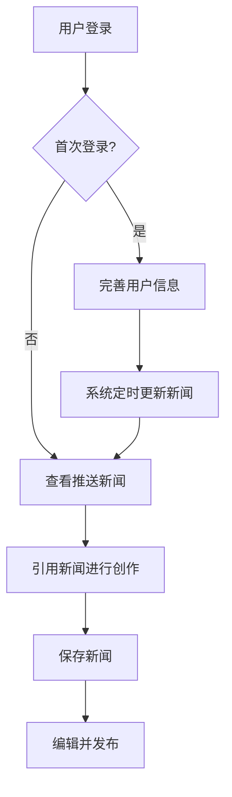

# AI 新闻创作工具 - 产品需求文档

## 1. Product Overview
AI 新闻创作工具是一个基于人工智能的桌面端新闻创作平台（支持 Mac 和 Windows），帮助用户快速获取行业新闻并进行二次创作和发布。

## 2. Core Features

### 2.1 User Roles
| Role | Registration Method | Core Permissions |
|------|---------------------|------------------|
| Normal User | Email/Social login | 完整功能访问 |

### 2.2 Feature Module
1. **对话交互页面**：新闻推送、AI 对话、新闻创作
2. **用户设置页面**：行业关注、关键词设置
3. **新闻管理页面**：保存的新闻、编辑和发布
4. **系统配置页面**：AI 模型配置、推送平台配置
5. **登录/注册页面**：用户认证

### 2.3 Page Details
| Page Name | Module Name | Feature description |
|-----------|-------------|---------------------|
| 对话交互页面 | 新闻推送区域 | 顶置显示最近 24 小时内基于用户设置检索到的新闻 |
| 对话交互页面 | AI 对话区域 | 以对话形式与 AI 交互，支持引用新闻进行二次创作 |
| 对话交互页面 | 新闻引用功能 | 点击新闻卡片即可引用该新闻作为创作参考 |
| 用户设置页面 | 行业选择 | 用户选择关注的行业领域 |
| 用户设置页面 | 关键词管理 | 用户添加、删除关键词用于新闻检索 |
| 新闻管理页面 | 新闻列表 | 显示用户保存的所有新闻 |
| 新闻管理页面 | 编辑功能 | 对已保存的新闻进行再次编辑 |
| 新闻管理页面 | 发布功能 | 将新闻推送到官网新闻板块和微信公众号 |
| 系统配置页面 | AI 模型配置 | 配置 AI 模型的 API 密钥、模型选择等参数 |
| 系统配置页面 | 推送平台配置 | 配置官网和微信公众号的发布接口 |

## 3. Core Process

用户首次登录 → 完善用户基本信息（行业、关键词）→ 系统按固定时间（早 8 点、下午 3 点）更新新闻 → 用户打开应用查看推送的新闻 → 点击新闻引用进行 AI 二次创作 → 保存创作的新闻 → 编辑并推送到指定平台

## 4. User Interface Design

### 4.1 Design Style
- **Primary Color**: 深蓝 (#1e40af) 配合科技感的渐变效果
- **Secondary Color**: 青色 (#06b6d4) 用于强调和交互元素
- **Button Style**: 圆角矩形，带有微妙的悬停动画效果
- **Font**: Inter 用于正文，Space Grotesk 用于标题
- **Layout Style**: 左侧导航 + 主内容区的经典布局，新闻卡片采用卡片式设计
- **Icon Style**: 使用 Lucide 图标库，保持简洁现代风格

### 4.2 Page Design Overview
| Page Name | Module Name | UI Elements |
|-----------|-------------|-------------|
| 对话交互页面 | 新闻推送区域 | 固定在页面顶部，横向滚动的新闻卡片，带有时效标签 |
| 对话交互页面 | AI 对话区域 | 类似聊天应用的布局，支持消息气泡、引用标记 |
| 用户设置页面 | 表单区域 | 简洁的表单设计，行业选择使用多选卡片，关键词支持标签式输入 |
| 新闻管理页面 | 新闻列表 | 网格布局的新闻卡片，支持搜索和筛选 |
| 系统配置页面 | 配置表单 | 分组的配置项，带有保存和测试按钮 |

### 4.3 桌面端特性
- **Mac 平台**:
  - 原生菜单栏集成
  - 系统托盘图标
  - 原生通知中心推送
  - 窗口阴影和圆角优化
  - 支持全屏模式
- **Windows 平台**:
  - 原生任务栏集成
  - 系统托盘图标
  - Windows 通知中心推送
  - 窗口边框和阴影优化
  - 支持最大化/最小化
- **通用桌面特性**:
  - 窗口最小化到托盘
  - 新闻更新时弹出系统通知
  - 快捷操作菜单
  - 离线数据缓存

### 4.4 交互细节
- 新闻推送区域：带有轻微的视差滚动效果
- 对话消息：渐入动画效果
- 按钮：悬停时的微妙缩放和颜色变化
- 系统通知：新新闻推送时触发桌面通知
