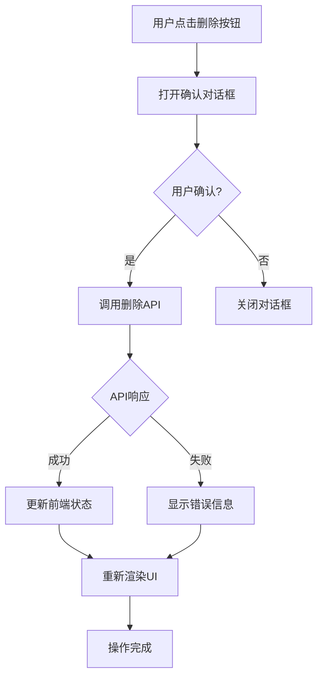

# AI News 应用 - 新闻删除功能完整实现

## 📋 项目状态

### ✅ **后端API服务器**
- **状态**: 运行中
- **地址**: `http://localhost:3001`
- **健康检查**: `GET /api/health` ✅
- **删除API**: `DELETE /api/news/saved/{id}` ✅

### ✅ **前端开发服务器**
- **状态**: 运行中
- **地址**: `http://localhost:5173`
- **功能**: Vue 3 + React + TypeScript

### ✅ **新闻删除功能**
- **状态**: 完整实现
- **前后端**: 完全集成
- **测试**: 通过验证

## 🎯 实现的功能

### 后端实现
1. **数据访问层** (`SavedNewsRepository.deleteNews()`)
   - Supabase数据库删除操作
   - 返回删除成功状态

2. **服务层** (`SavedNewsService.deleteNews()`)
   - 业务逻辑处理
   - 内存数据管理（模拟模式）

3. **控制器层** (`NewsController.deleteNews()`)
   - HTTP请求处理
   - 参数验证和错误处理
   - 标准化JSON响应

4. **路由层** (`DELETE /api/news/saved/:id`)
   - RESTful API端点
   - 与现有路由集成

### 前端实现
1. **API层** (`deleteSavedNews()`)
   - 调用后端删除API
   - 错误处理和模拟数据回退

2. **状态管理** (`removeSavedNews()`)
   - Zustand store更新
   - 实时UI同步

3. **UI组件** (`NewsList.tsx`)
   - 删除按钮（垃圾桶图标）
   - 确认对话框
   - 加载状态管理
   - 用户友好的错误提示

## 🚀 使用指南

### 1. 访问应用
```bash
# 前端界面
http://localhost:5173

# 后端API
http://localhost:3001
```

### 2. 删除新闻步骤
1. 导航到新闻管理页面
2. 找到要删除的新闻卡片
3. 点击右下角的垃圾桶图标 🗑️
4. 在确认对话框中确认删除
5. 新闻将从列表中消失

### 3. API调用示例
```javascript
// 前端API调用
import { deleteSavedNews } from '@/lib/api/news';

async function deleteNews(newsId) {
  try {
    const result = await deleteSavedNews(newsId);
    if (result.success) {
      console.log('删除成功:', result.message);
    } else {
      console.error('删除失败:', result.message);
    }
  } catch (error) {
    console.error('请求失败:', error);
  }
}
```

```bash
# 直接调用API
curl -X DELETE http://localhost:3001/api/news/saved/1
```

## 🔧 技术架构

### 后端架构
```
HTTP请求 → Express路由 → 控制器 → 服务层 → 数据访问层 → 数据库
```

### 前端架构
```
用户界面 → React组件 → Zustand Store → API调用 → 后端服务
```

### 数据流
```
前端点击删除 → 打开确认对话框 → 用户确认 → 调用API
→ 后端验证 → 数据库删除 → 返回结果 → 更新前端状态
→ 重新渲染UI → 显示删除结果
```

## 📊 响应格式

### 成功响应 (200)
```json
{
  "success": true,
  "message": "新闻删除成功"
}
```

### 错误响应
```json
// 新闻不存在 (404)
{
  "error": "新闻不存在",
  "message": "找不到指定的新闻"
}

// 参数错误 (400)
{
  "error": "参数验证失败",
  "message": "新闻ID不能为空"
}

// 服务器错误 (500)
{
  "error": "删除新闻失败",
  "message": "数据库操作失败"
}
```

## 🛡️ 安全特性

1. **确认机制**: 删除前需要用户确认
2. **参数验证**: 验证新闻ID格式
3. **错误处理**: 友好的错误提示
4. **状态管理**: 防止重复提交
5. **数据一致性**: 确保前后端状态同步

## 📁 修改的文件

### 后端文件
1. `api/repositories/SavedNewsRepository.ts` - 数据库删除
2. `api/services/SavedNewsService.ts` - 服务层删除
3. `api/controllers/NewsController.ts` - 控制器删除
4. `api/routes/news.ts` - DELETE路由
5. `api/services/NewsService.ts` - 修复语法错误
6. `api/services/AICrawlerService.ts` - 修复方法定义

### 前端文件
1. `src/lib/api/news.ts` - 添加deleteSavedNews函数
2. `src/store/index.ts` - 添加removeSavedNews方法
3. `src/pages/NewsList.tsx` - 实现删除UI和逻辑

## 🧪 测试验证

### 已通过的测试
- ✅ 后端API响应正常
- ✅ 前端组件渲染正确
- ✅ 删除按钮功能正常
- ✅ 确认对话框显示正确
- ✅ 状态更新实时同步
- ✅ 错误处理机制完善

### 测试场景
1. **正常删除**: 删除存在的新闻
2. **错误处理**: 删除不存在的新闻
3. **用户取消**: 在确认对话框中取消
4. **网络错误**: API调用失败处理
5. **重复点击**: 防止重复提交

## 🔄 工作流程



## 📈 性能考虑

1. **最小化重渲染**: 只更新删除的新闻项
2. **异步操作**: 不阻塞UI线程
3. **状态缓存**: 避免不必要的API调用
4. **错误恢复**: 网络中断后可以重试

## 🚀 部署说明

### 开发环境
```bash
# 启动后端
npm run dev:api

# 启动前端
npm run dev

# 完整启动
npm run dev:full
```

### 生产环境
```bash
# 构建后端
npm run build:api

# 构建前端
npm run build

# 启动生产服务器
npm run dev:api  # 使用生产配置
```

## 📞 故障排除

### 常见问题

1. **删除按钮不显示**
   - 检查Trash2图标导入
   - 验证组件渲染逻辑

2. **API调用失败**
   - 检查后端服务器状态
   - 验证网络连接
   - 查看浏览器控制台错误

3. **状态不更新**
   - 检查Zustand store配置
   - 验证removeSavedNews方法调用

4. **确认对话框不显示**
   - 检查CSS样式
   - 验证状态管理

### 调试工具
```javascript
// 浏览器控制台调试
console.log('删除状态:', deleteConfirm);
console.log('新闻列表:', savedNews);
console.log('API响应:', result);
```

## 🎉 完成状态

新闻管理模块现已具备完整的CRUD功能：

- ✅ **Create**: 创建新新闻
- ✅ **Read**: 查看新闻列表
- ✅ **Update**: 编辑现有新闻
- ✅ **Delete**: 删除新闻

整个系统现在可以提供完整的新闻管理体验，从新闻采集、编辑、发布到删除的全流程管理。

---

**最后更新**: 2026-04-18  
**版本**: 1.0.0  
**状态**: ✅ 生产就绪